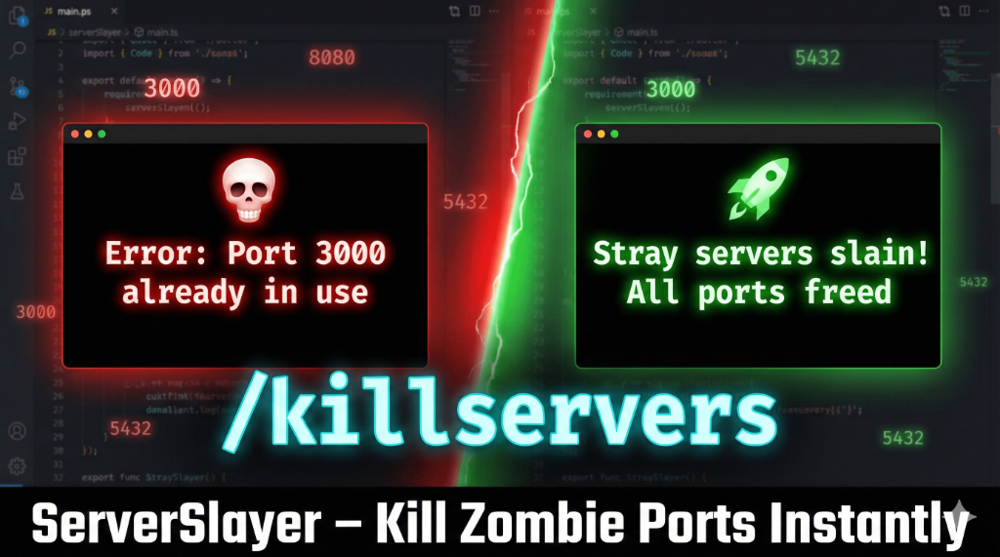

<h1 align="center">⚔️ ServerSlayer</h1>
<h3 align="center">Kill Stray Development Servers • Free "Port in Use" Errors Instantly</h3>

<p align="center">
  
  
  
  
</p>

<p align="center">
  <strong>Open-source AI agent to safely terminate stray localhost processes and free blocked ports.</strong><br>
  Works with <b>Node.js, Python/Django/Flask, Java/Spring Boot, Ruby/Rails, Go, PHP</b> and more.
</p>

---

## 🎬 Demo

<p align="center">
  <a href="https://youtu.be/Fetdo7CfPIs">
    
  </a>
</p>
<p align="center"><em>👆 Click to watch the demo video</em></p>

---

## 🚨 The Problem: "Port Already in Use"

Every developer knows this pain:
```
Error: listen EADDRINUSE: address already in use :::3000
```

You forgot to stop a dev server. Now you're hunting PIDs manually. **Not anymore.**

---

## ✨ The Solution: One Slash Command

```
/killservers
```

That's it. ServerSlayer finds and safely kills stray development servers, idle localhost processes, and zombie dev servers — instantly.

---

## 🎯 Features

| Feature | Description |
| :--- | :--- |
| **Kill Stray Servers** | Terminate localhost processes blocking your ports |
| **Safe Port Killer** | Never kills databases, Docker, ngrok, or IDE processes |
| **Idle Server Detection** | Identifies unresponsive/zombie dev servers |
| **Cross-Platform** | Works on Windows, macOS, and Linux |
| **Multi-Framework** | Node.js, Python, Java, Ruby, Go, PHP support |
| **Any Agentic IDE** | Cursor, Antigravity, Continue.dev, Windsurf, VS Code + AI |

---

## 🚀 Quick Install

### Step 1: Clone

```bash
git clone https://github.com/supratikpm/ServerSlayer.git
```

### Step 2: Copy to Your Project

**Windows (PowerShell):**
```powershell
Copy-Item -Path "path\to\ServerSlayer\.agent" -Destination ".\" -Recurse -Force
```

**macOS / Linux:**
```bash
cp -r /path/to/ServerSlayer/.agent ./
```

### Step 3: Use It!

Type `/listports` or `/killservers` in your AI chat. Done!

---

## 📖 Slash Commands

| Command | What it does |
| :--- | :--- |
| `/listports` | 📋 List all running dev servers on localhost |
| `/killservers` | 🔪 Kill stray servers (graceful termination) |
| `/nukeports` | ☢️ Force kill all dev servers |
| `/killport 3000` | 🎯 Kill specific port |

---

## 🖥️ Works in Any Agentic IDE

ServerSlayer is **IDE-agnostic**. Tested and works with:

| IDE | Setup |
| :--- | :--- |
| **Cursor** | Add `.cursorrules` (see below) |
| **Antigravity** | Just copy `.agent/` folder |
| **Continue.dev** | Copy `.agent/` folder |
| **Windsurf** | Copy `.agent/` folder |
| **VS Code + AI** | Use system prompt (see below) |
| **Any AI Assistant** | Use the Python script directly |

<details>
<summary><b>📋 Cursor IDE Setup (.cursorrules)</b></summary>

Create `.cursorrules` in your project root:

```
You have access to ServerSlayer workflows in .agent/workflows/.
When the user mentions ports, servers, or "port in use" errors, use:
- /listports - to see what's running
- /killservers - to safely kill dev servers
- /killport <port> - to kill a specific port
- /nukeports - for force kill

Run: python .agent/tools/server_slayer_tools.py [list|kill] [options]
```

</details>

<details>
<summary><b>🤖 Claude / ChatGPT / Any AI Setup</b></summary>

Add to your system prompt:

```
You have ServerSlayer for port management.

Commands:
python .agent/tools/server_slayer_tools.py list
python .agent/tools/server_slayer_tools.py kill --scope=project
python .agent/tools/server_slayer_tools.py kill --force
python .agent/tools/server_slayer_tools.py kill --port 3000

SAFETY: Never kill ports 3306, 5432, 27017, 6379 (databases).
```

</details>

---

## 🛡️ Safety First: Protected Services

ServerSlayer **automatically protects** critical services:

| Category | Protected |
| :--- | :--- |
| **Databases** | MySQL (3306), PostgreSQL (5432), MongoDB (27017), Redis (6379) |
| **Tunnels** | ngrok, SSH (22) |
| **IDE Processes** | Cursor, VSCode, Antigravity, JetBrains |
| **Containers** | Docker daemon |

---

## 🔧 How It Works (Code Visibility)

The core logic is in `server_slayer_tools.py`:

```python
# Detection: Find all listening ports
def get_listening_ports():
    if SYSTEM_OS == "Windows":
        output = run_command(["netstat", "-ano"])
        # Parse LISTENING ports...
    else:  # macOS / Linux
        output = run_command(["lsof", "-iTCP", "-sTCP:LISTEN", "-n", "-P"])
        # Parse listening ports...

# Safety: Never kill protected services
PROTECTED_PORTS = [3306, 5432, 27017, 6379, 1433, 22]
PROTECTED_PROCESSES = ["docker", "postgres", "mysql", "ngrok", "vscode", "cursor"]

# Kill: Graceful first, force if needed
def kill_process(pid, force=False):
    if SYSTEM_OS == "Windows":
        subprocess.run(["taskkill", "/PID", str(pid), "/F" if force else ""])
    else:
        subprocess.run(["kill", "-9" if force else "", str(pid)])
```

**Full source:** [server_slayer_tools.py](https://github.com/supratikpm/ServerSlayer/blob/main/.agent/tools/server_slayer_tools.py)

---

## 📁 Project Structure

```
.agent/                          # 👈 Copy this folder to any project
├── tools/
│   └── server_slayer_tools.py   # Core detection & kill logic
└── workflows/
    ├── listports.md             # /listports command
    ├── killservers.md           # /killservers command
    ├── killport.md              # /killport command
    └── nukeports.md             # /nukeports command
```

---

## 🔧 Supported Frameworks

| Framework | Default Ports |
| :--- | :--- |
| **Node.js** (Next.js, Vite, CRA) | 3000, 3001, 5173 |
| **Python** (Django, Flask, FastAPI) | 8000, 5000 |
| **Java** (Spring Boot, Tomcat) | 8080 |
| **Ruby** (Rails) | 3000 |
| **Go** | 8080 |
| **PHP** | 8000 |

---

## 🤝 Contributing

PRs welcome! See [CONTRIBUTING.md](CONTRIBUTING.md)

**Help needed:**
- 🍎 macOS/Linux testing
- 🧩 More framework detection
- 🎬 Better demo GIF

---

## ⭐ Star This Repo

If ServerSlayer saved you from "port already in use" hell:

<p align="center">
  <a href="https://github.com/supratikpm/ServerSlayer">
    
  </a>
</p>

---

## 🔍 Keywords

`kill stray servers` • `port already in use` • `terminate localhost processes` • `safe port killer` • `idle server killer` • `free blocked ports` • `dev server cleanup` • `cursor rules` • `ai agent` • `antigravity ide`

---

<p align="center">
  <strong>⚔️ Stray servers slain! Happy coding! 🚀</strong>
</p>

<p align="center">
  Made with ⚔️ by <a href="https://github.com/supratikpm">@supratikpm</a>
</p>
